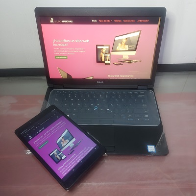
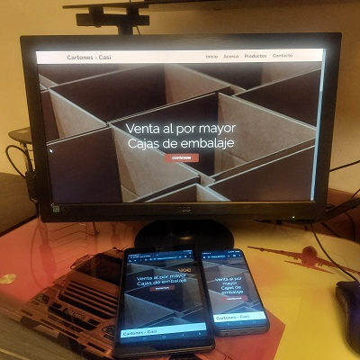

# Taller de Maquetación: Landing Page tipo Portafolio-CV de Figma a Código HTML y CSS

Es una Landing Page tipo con la temática de curriculum o portafolio,  asi evitas un documento de Word, Ilustrator la ventaja es que con un enlace cualquier persona podra verlo.

Tenemos 3 versiones: para version mobil, tableta y la version descktop,

No vamos a usar ningun framework frontend bootstrap ni tailwind ni ningun otro.

Lo vamos hacer con puro css y html, ojo ya tienes que saber los fundamentos de: flexbox, gridcss, css, html, y algo de js

### Organizando el proyecto y los assets

descarga los assets en esta se encuentra toda la parte de la multimedia

### ¿Como esportar assets desde un documento de Figma?

Cuando ya tienes una referencia visual tu ya puedes extraer los recursos.

Imagin que tu eres el diseñador y el programador ala vez pues figma te ayuda a hacer la parte de diseño (propuesta visual)

si ya tienes una propuesta visual en Figma, puedes hacer click en los iconos y exportarlo en varios formatos

hay otras herramientas para hacer propuestas visuales: adobe xd,  Photoshop, sketech, si te comparten el archivo editable,  tu puedes ir exportando cada uno de estos elementos

### Arquitectura  CSS Minimalista(StyleGuides)

Ahi está toda las guias de estilo que vamos ausar, es decir: los codigigos de colores los tamaños de los textos, antes de pasar esto a css, vamonos a nuestra hoja de estilos Stile.css, (como va ser un proyecto muy sencillo no voy a usar ninguna arquitectura como: Smax) tampocomo voy a usar hipsters como : Sass Less, stylus. Lo voy a maquetar con puro código CSS, me gusta llevar mi minimalismo a la parte profecional (cuando desarrollo proyectos o aplicaciones web), eres libre de utilizar la escritura de selectores que desees.

Cuando estoy haciendo pequeños proyectos que no van a escalar como es que yo llevo acabo la arquitectura CSS , lo primero a hacer:

> mediante comentarios de CSS te voy a ir dividiendo las secciones en las que yo trabajo 

* defino las Custom propertis(variables) 

* ``Reseteo`` 

* `Componente` cada ves que yo vaya a diseñar un componente a nivel de UI voy poniendo los estilos de ese componente, de tal manera que si en ambos proyectos utilizo  un mismo componente, nada más copio y pego de un proyecto a otro el codigo CSS, html y yá. vamos a tener odenado el código por cada uno de los componentes que vayamos desarrollando

* `Utilities` si trabajaste con algunos frameworks como bootstrap,  ves que tienen algunas clases auxiliares que nos permiten "aplicar bordes(cuadrados, redondeados...)" color de letra, fondo, alinear texto,  para mí todas esas son clases de css utilitarias

* `Site Styles` son los codigos de estilos css muy particulares y que dificilmente podria reutilizar en otro, de tal manera que cuando voy pasando de un proyecto a otro todo lo que haya hecho en un primer proyecto de  _Utilities, Components, Reset, Custom-Properties_ los puedo reutilizar

Con esta tecnica conforme vayas haciedo maquetaciones de proyectos te vas a ir creando como un pequeño miniFramework, esta es la forma en la que yo trabajo pequeños proyectos, trato de irme a lo mas minimalista posible, aparte de minimalista que sea DRY( Don't repeat yourself)-> todo lo que ya hiciste una vez, trata de reutilizarlo tantas veces y no te repitas si ya lo tienes simplemente reutiliza.

### Pasando una guia de estilos de Figma a Css

en figma ya tenemos las guias de estilos donde está (la definicion de colores, y tamaños de letra)


- Empiezo a definir mis ``Custom Properties`` y voy a empesar a respetar el nombre de color que me dieron y estas van a ser vaviables globales y por eso las vamos a definir en el selector **root** (el selector Root es la etiqueta html con mayor jerarquia)

> Es muy importante si trabajas con un diseñador dile que le ponga nombres alucivos a lo que va hacer ese estilo que está diseñando


> El tamaño de los encabezados los voy a convertir a rems(es una unidad relativa) a diferencia del px(que es una unidad absoluta) 

```css
    


/* ***********************Custom Properties************************** */

:root{
    --first-color: #d90062;
    --first-alpha-color: rgba(217, 0, 98, 0.75);
    --second-color: #14192d;
    --second-alpha-color: rgba(20, 25, 45, 0.75);
    --third-color: #501462;
    --third-alpha-color: rgba(80, 20, 100, 0.75);
    --white-color: #fff;
    --gray-light-color: #f3f3f3;
    --gray-color:#ccc;
    --gray-dark-color: #666;
    --black-color: #000;
    --link-color: #509ee3;
    --title-color: #333;
    --text-color: #222;
    --white-alpha-color: rgba(255, 255, 255, 0.5);
    --black-alpha-color: rgba(0, 0, 0, 0.5);
    /*tipografia*/
    --font: "Raleway", sans-serif;
}
/* ***********************Reset************************** */
html{
    /*modelo de caja: vamos hacer que el tamaño de la caja empieze desde el borde
     y no desde el contenido como es por default por que si lo dejamos desde
     el contenido corremos el riesgo de que cuando asignamos paddings o borders
     pues los tamaños no correspondan*/
    box-sizing: border-box;
    font-family: var(--font); /*definimos la familia de fuente*/
    font-size: 16px; /*tamaño de letra del html explicitamente, ¿Por que?  
    por que como voy a estar utilizando la unidad de medida REM (rem es basado
    en el tamaño de la tipografia de la etiqueta html*/

    /*para la transicion*/
    scroll-behavior: smooth;
}


/*con el selector universal todo los elementos su contenido generado dinamicamente
    con after y before que hereden el tamaño de caja y ¿de quien van a heredar
    el tamaño de caja? del nodo principal que es la etiqueta html
*/
*,
*::after,
*::before{
    box-sizing: inherit; /*hereda*/
}
/*por defecto trae 8 pixeles de margin*/
body{
    margin: 0;
    overflow-x: hidden; /*oculta todo lo que desborda en el eje x (horizontal) oculta la barra de desplazamiento*/
    color: var(--text-color);
}

/*Estilo a los links*/
a{
    color: var(--link-color);
    transition: all 0.5s ease-out;
}

a:hover{
    opacity: 0.75;
}

/*todo los encabezados tienen un poco de margen ariba y abajo dependiendo
    del nivel de encabezado van variando los márgenes, lo que me gusta es
    resetar el margen de los encabezados a 0 y ya yo darle la distancia
    adecuada
*/
h1{
    margin: 0;
    font-size: 2rem;
}

h2 {
    margin: 0;
    font-size: 1.5rem;
}
  
h3 {
    margin: 0;
    font-size: 1.25rem;
}
  
h4 {
    margin: 0;
    font-size: 1rem;
}
  
h5 {
    margin: 0;
    font-size: 0.85rem;
}
  
h6 {
    margin: 0;
    font-size: 0.7rem;
}
/*Imagenes Responsivas HACK*/
img{
    max-width: 100%;
    height: auto;
}
/*Estilo a los párrafos*/
p{
    line-height: 1.6rem;
}

/* ***********************Componentes************************** */
/* ***********************Utilities************************** */

.box-shadow-1{
    /* box-shadow: 4px 4px 16px rgba(0, 0, 0, 0.25); */
    box-shadow: .25rem .25rem 1rem rgba(0, 0, 0, 0.25);
}

/* ***********************Site Styles************************** */
```

### Reseteo CSS básico

tu me vas a ver escribir un selector dependiendo si es: componenete, reseteo, utilidad , o si ya son estilos particulares, en cada una de estas secciones lo que yo suelo hacer es ordenar de forma alfabetica los elementos salvo el html y el body. A partir del html y el body toda las etiquetas y selectores los voy ordenando de manera alfabética, ¿por que de manera alfabetica? por que imagina que estas en una biblioteca, se hace mas facil encontrar un libro si está ordenado alfabeticamente, es la misma analogia

> buscamos en google fonts la fuente,  no es una buena opcion estar saturando de tantos estilos un archivo tipográfico, es mejor traerse todo los tamaños `FULL AXIS`

> Respetando el orden alfabético exceputuando html y body que son  como las etiquetas padres  de todo el DOM de html entonces apartir de ahi voy de manera alfabética

### Secciones semánticas HTML del proyecto

> Recuerda que al ser una landin page en un solo documento html la parte de la url que va despues del hash va cambiar por el nombre de los ``Id(enlaces)`` como el contenido de la landin page va estar en español pues aunque sean enlaces internos en la url se vaya cambiando en español el nombre de la seccion en la que nos encontramos

### Maquetando mobil Header

Siento que la cabecera de un sitio a otro si podria variar entonces el maquetado como tal del contenedor cabecera lo voy a poner en mi seccion de `/* ***********************Site Styles************************** */` en cambio el menú de amburguesa ese si lo voy a considerar como un componente y lo voy a poner en la seccion de `/* ***********************Componentes************************** */`  


```css
    .header{
    position: fixed; 
    left: 0;
    bottom: 0;

    z-index: 999;
    padding: 1rem; /*1rem + 1rem + 2 rem contenido = 4 rems se hace un centrado perfecto ♥😀*/
    width: 100%;/*ya que perdio sus propiedades de ancho y alto*/
    height: var(--header-height);
    background-color: var(--second-color);
}

.header > .container{
    display: flex;
    justify-content: space-between;
    align-items: center;
}

.logo a{
    color: var(--first-color);
    font-weight: bold;
    font-size: 2rem;
    text-decoration: none;
}

```

### Maquetando Movil Menú.


El Boton tien un Outline un borde blanquecino. lo cambiamos de color

> La propiedad bottom de CSS establece la posición vertical de un ``elemento posicionado``

el menú de navegacon por default va empesar con una opacidad en 0 y voy hacer uso de una clase auxiliar que con JS se la agregue y active el comportamiento del menú para que pueda mostrarse u ocultarse

La propiedad `pointer-events` es una propiedad en css  que le dice  si activamos o no la reaccion a interactividad del elemento html en cuestion

```css
    .menu-btn{
    outline: thin solid var(--first-color);
    border: 0;
    cursor: pointer;
    background-color: var(--second-color);
}

.menu-btn svg{
    fill: var(--first-color); /*aplicamos relleno a los svg's*/
}


.menu{
    /* display: none; */
    position: fixed;
    left: 0;
    bottom: var(--header-height); /*distancia*/
    width: 100%;
    display: flex;
    flex-direction: column;
    background-color: var(--second-color);

    opacity: 0; /*lo volvemos invicible*/
    pointer-events: none;
    transition: opacity 0.5 ease;
}

/*¿Cuando se va activar el menú, esta clase lo vamos a activar con JS?*/
.menu.is-active{
    opacity: 1;
    pointer-events: auto;
}

.menu a{
    padding: 1rem; /*pading de 1 rem a los 4 lados*/
    font-size: 1.5rem;
    font-weight: bold;
    text-align: center;
    text-decoration: none;
    color: var(--first-color);
}

/*en el estado hover invertimos los colores*/
.menu a:hover{
    color: var(--white-color);
    background-color: var(--first-color);
}
```

### Programación Menú movil

voy a utilizar la tecnica de _Funcion anónima autoejecutable_

cada funcionalidad de los componentes que vayamos a programar para este portafolio

Si este sitio fuera un sitio **Multi-page** es decir en lugar de decir vete al _Id Servicios_ se fuera a un archivo externo Servicios.html, pues en el monento que le demos click se va cerrar el documento.

pero como aca tenemos una **Landing-page**(un sitio que está en un solo documento html), pues me navega por las seciones. y no cierra el menú

Entonces yo debo programar una rutina que cuando detecte el click de algun enlace de los que están dentro del elemento menú pues le quite la clase `is-active` para cerar el menú y adicionalmente le regrese la clase none al icono. y le quite  la clase none al elemento de las barras para que el boton del menú regrese.

Como aqui yo puedo tener tantos enlaces como secciones tenga mi Landing page pues yo no voy a estar programando el evento de cada uno de esos menús. Entonces lo que vamosa utilizar aca es la tecnica de delegacion de eventos

```javaScript
    ((d)=>{
    const $btnMenu = d.querySelector(".menu-btn"),
        $menu = d.querySelector(".menu");

    $btnMenu.addEventListener("click", (e)=>{
        //quiero que al primer elemento hijo en su lista de clases
        //le intercambie la clase "None"
        $btnMenu.firstElementChild.classList.toggle("none"); // primer click
        $btnMenu.lastElementChild.classList.toggle("none"); // segundo click
        $menu.classList.toggle("is-active");

    });

    d.addEventListener("click", (e)=>{
        //objeto= e.target
        //método = matches 
        if (!e.target.matches(".menu a")) return false
        // si el evento que origino el click es un enlace que está dentro del menú
        $btnMenu.firstElementChild.classList.remove("none"); 
        $btnMenu.lastElementChild.classList.add("none"); 
        $menu.classList.remove("is-active");

    })
})(document);
```
### Maquetando escritorio Header y Menú

El posicionamiento es una mescla entre el posicionamiento `relativo` y el `fijo(fixed)` la diferencia es que se va comportar como elemento fijo a la altura que tu le definas

¿Cual es la ventaja? a diferencia del `position fixed` no tapa el contenido que está definido en el html.

No encuentro el tamaño de contenido, las letras del logo ocupan mas, pense que era por el espaciado que habia entre letras de ariba y abajo pero es algo más.


Observa que ahi dice `2rem = 32px` pero el contenido me dice que ocupa 37.6px, claro el tamaño del texto si se respeta, pero el espacio que ocupa no. entonces para obener la altura del __Header__:

>  `37.6 / 16 = 2.35rem` y a esto lo sumamos (0.5rem + 0.5rem = ``1rem``)  ya lo vi en laptop y los valores no cambiaron

> `height: calc(2.35rem + 1rem);`

> **_la clave seria buscar el elemento con mayor tamaño de altura en el contenido del header y hacer calculos_**


 >   ``padding: calc((var(--header-height) - 2.35rem) * 0.5);``


lo multiplique por 0.5 por que dividirlo a 2 no me dio resultados.

> lomejor seria no tener altura difinida en el header sino que se calcule en base al contenido y padding

```css
    .header{
    position: fixed; 
    left: 0;
    bottom: 0;

    z-index: 999;
    /*padding: 1rem; /*1rem + 1rem + 2 rem contenido = 4 rems se hace un centrado perfecto ♥😀*/
    padding: calc((var(--header-height) - 2.35rem) * 0.5); /*2.35rem = 37.6px es el espacio que ocupa la letra del logo*/
    width: 100%;/*ya que perdio sus propiedades de ancho y alto*/
    height: var(--header-height);
    background-color: var(--second-color);
}

.header > .container{
    display: flex;
    justify-content: space-between;
    align-items: center;
}

.logo a{
    color: var(--first-color);
    font-weight: bold;
    font-size: 2rem;
    line-height: normal;
    text-decoration: none;
}

/* @media screen and (min-width:768px){ */
@media screen and (min-width:48em){
    
}
/* @media screen and (min-width:1024px){ */
@media screen and (min-width:64em){
    .header{
        position: sticky;
        top: 0;
        padding: 0.5rem;
        /*voy a modificar dinamicamente la altura de la cabezera*/
        /* height: calc(var(--header-height) - 0.5rem); */ /*JONMIRCHA*/
        /* height: var(--header-height); */
        /**/
        height: calc(2.35rem + 1rem);
    }
}
```

### Maquetando sección Home y componenetes Hero Image

de la arquitectura CSS: que los nombres de los selectores tengan sentido  y sean semanticos al contenido que estás trabajando cada quien es libre de aplicar la nomenclatura para escribir su codigo CSS 

> no vamos a usar un boton, vamos a usar un enlace.

> En el HTML creo una image que se va a llamar --image y que su valor va ser la funcion URL de css y le paso la ruta, al definir esta bariable tiene un alcance va existir solo en el article.

```html

```

esta tecnica me va permitir que cuando estemos maquetando la seccion de los clientes

> El opacity solamente tiene como contenedor hijo `hero-image-content` entonces el modelo de flexbox me va servir se voy aplicar un centrado perfecto

> el fondo se mantienen fijo mientras scrolleo el contenido

Modificando el tamaño del titulo de la hero image, _para no estar cambiando el tamaño en cada una de las mediaQueries una de las cosas que yo hago cuando tengo estos textos grandes  que se vayan redimencionando de manera fluida es aplicarle un tamaño de font-zise basados en las unidades del viewPort_

 para este componenete no hize media querys es una tecnica que está muy de moda que se llama fluid design: **Texto Fluido**  hacer responsive design con la menor cantidad posible de media querys


### Marcado HTML seccion Acerca

Tiene 3 columnas de contenido.

el Frame de figma en ancho es 1280px

La mayoria del contenido está alineado a esta guia que está a 40px y a 124px, sumanos dan 1280px 

Por lo tanto el tamaño maximo de crecimiento en ancho al que tendria que ir esta seccion es de 1280px ? 

esto me va permitir controlar el crecimiento eso significa que voy a ponerle un container en el maquetado html.

> _Todo concepto que está en un idioma extrangero se tiene que poner en Itálica_ tolo los acrónimos, toda las palabras que esté en ingles (web, full stack frelanze...etc)

no olvides poner el texto _`alt`_ por cuestiones de `SEO` por que cuando una imagen está rrota pues es lo que aparece visualmente  y tambien para las personas que son ciegas y tienen sus narradores ese es el texto que lee donde va la imagen
```html
    <article>
            <h2>Mis habilidades</h2>
            <div class="progress-b">
                <p>
                    <b>Desarrollo <i>Web Frontend</i></b>
                    <b>80%</b>
                </p>
                <progress value="80" min="0" max="100"></progress>
            </div>
            <div class="progress-b">
                <p>
                    <b>Diseño <i>Web</i></b>
                    <b>75%</b>
                </p>
                <progress value="75" min="0" max="100"></progress>
            </div>
            <div class="progress-b">
                <p>
                    <b>Desarrollo <i>Web Backend</i></b>
                    <b>65%</b>
                </p>
                <progress value="65" min="0" max="100"></progress>
            </div>
            <div class="progress-b">
                <p>
                    <b><i>Marketing</i>de contenido</b>
                    <b>70%</b>
                </p>
                <progress value="70" min="0" max="100"></progress>
            </div>
        </article>
```


### Componente Barra de Progreso

vamos a utilizar una etiqueta muy joven en el estandar de html

> para algunos navegadores se necesita una Pseudoclase `webkit, moz`


las barras de progreso se van a adaptar al tamaño del contenedor no hay necesidad de hacer responsive design al igual que el tamaño de las letras que dice bien venid@s

> Nos combiene generar algunas clases utilitarias con responsive design muy al estilo de bootstrap `text-center, text-medium-center, text-lg-center`.

```css
/* ******* ProgressBar ********* */

progress{
    width: 100%;
    height: 1rem;
    background-color: var(--gray-color);
}

progress::-webkit-progress-bar{
    background-color: var(--gray-color);
}

progress::-webkit-progress-value{
    background-color: var(--gray-dark-color);
}

progress::-moz-progress-bar{
    background-color: var(--gray-dark-color);
}

.progress-b{
    margin: 1rem auto;
}
.progress-b > p{
    margin: 0;
    display: flex;
    justify-content: space-between;
    font-size: 0.85rem;
}

```

### Clases utilitarias Responsivas

creamos clases utilitarias muy al estilo de Bootstrapt

```css
    .text-center{
    text-align: center;
}

.text-left{
    text-align: left;
}

.text-right{
    text-align: right;
}

/*para pc creo una media query*/
@media screen and (min-width:64rem){
    .text-lg-center{
        text-align: center;
    }
    
    .text-lg-left{
        text-align: left;
    }
    
    .text-lg-right{
        text-align: right;
    }
}
```

el texto del article en tamaño Large se va a la derecha. en lugar de estarme preucupando por selectores individuales de contenido cree unas clases utilitarias para la alineacion del texto y esas clases utilitarias me las podria pasar a otro proyecto por que son bastante genéricas.

ve que las seccionenes tienen un espaciado solucion: darle un poco de padding

ve que hay una separacion de cuando acaba un contenido (la seccion tiene 3 contenidos), pero son estilos muy _particulares_ solucion: `.about > article{margin-bottom: 2rem;}`

### Maquetado Responsivo sección  Acerca

vamos hacer uso de grid css.


ve que en la version para PC está seccion está a 3 columnas

> recuerda: el grid el flujo por defecto es en filas y cuando tu no especificas las filas las filas se van generando implicitamente entonces aca lo importante era definir las columnas


pero mi pantalla es de 1920px full hd, ahora el tamaño maximo es de 1200 entonces nos hace falta agregar la clase utilitaria que ya tenemos llamada `container`

```css
     .full-lg-screen{
        width: 100%;
        min-height: 100vh;
    }
```

> lo elegante de una landing Page es que el contenido abarque todo el espacio posible, entonces me voy a crear una clase utilitaria para aplicar el efecto  de `FULL-SCREEN`

```css
    .about{
       display: grid;
       grid-template-columns: repeat(3, 30%); /*sobra 10%*/
       justify-content: space-between; /*el 10% sobrante lo distribuyo en espacios*/
       align-content: center; /*en el eje de Y me lo alinea el contenido al centro*/
    }

```

> _Quiero que se vayan dando cuenta que en algunas cosas sobre todo en el alineado interno de los componentes he usado ``Flexbox`` y en zonas especificas de maquetacion a diferentes columnas, estoy utilizando `Grid`_

> Recuerda: _la metafora que les digo si ustedes aprenden `Flexbox y Grid`  se van a convertir en una navaja Suiza  de la maquetación  Web_

### Marcado Html sección Servicios

Ve que los titulos(encabezados) de las secciones tienen un mismo estilo. Entonces vamos a crear una clase utilitaria para el titulo de las secciones.


> primero vamos a enfocarnos para la version de Movil

> Tengo que enfocarme  en diseñar  y luego replicar cada una de estas targenas, 

> Muy importante! _Estas targetas van a estar dentro de un contenedor por que mira en la seccion de servicios tiene este fondo gris claro y ese color en Pc Fluye al 100% de la pantalla, pero el contenido si tiene máxima anchura_

```html
    <section id="servicios" class="services section">
        <div class="container">
            <h2 class="section-title">¿Qué te ofrezco?</h2>
            <article class="service-card">
                <svg xmlns="http://www.w3.org/2000/svg" width="24" height="24" viewBox="0 0 24 24"><path d="M20,3H4C2.897,3,2,3.897,2,5v14c0,1.103,0.897,2,2,2h16c1.103,0,2-0.897,2-2V5C22,3.897,21.103,3,20,3z M4,19V7h16 l0.002,12H4z"/><path d="M9.293 9.293L5.586 13 9.293 16.707 10.707 15.293 8.414 13 10.707 10.707zM14.707 9.293L13.293 10.707 15.586 13 13.293 15.293 14.707 16.707 18.414 13z"/></svg>
                <h3>Programación <i>Web</i></h3>
                <p>
                    Desarrollo sitios y aplicaciones para plataformas <i>web</i>. Te ayudo a construir tu proyecto
                    de principio a fin;<i>Frontend</i>, <i>Backend</i> y base de datos.
                </p>
            </article>
        </div>
    </section>
```

### Maquetando Componente Service Card.

El fondo de la seccion tiene un fondo gris claro

> el estilo de las targetitas son propias de este proyecto.

> Ve que los iconitos son de color rosa, _Recuerda: a los SVGs les podemos aplicar la propiedad `FILL` y vamos a aplicarle un margin-Bootom_

```css
    .service-card{
    margin: 1rem auto; /*ariba y a los costado (para que se centre)*/
    padding: 1rem;
    text-align: center;
}

.service-card h3{
    color: var(--title-color);
}

.service-card svg{
    margin-bottom: 1.25rem;
    fill: var(--first-color);
}
```

### Maquetado Responsivo seccion Servicios.

Para la version de Tablet, vamos a trabajar a un grid de 2 columnas.

Vamos a la media query de 768px = 48em rem, 

¿Quíen es el elemento html que va aplicar el grid? no es la seccion `services` dentro tiene un contenedor `container` y ese contenedor es el que va delimitar la grid por que dentro tiene la h2  y sus `articles`.

entonces al `container` es al que le voy aplicar display grid, entonces el container que es hijo directo de la clase `servises` aplicale grid.


> _Recuerda: el titulo `H2` es un hijo del `container` entonces forma parte de la retícula de grid_ entonces ¿Sacamos del _container_ el _h2_? si lo sacamos puede que se salga de esos 1200px entonces al titulo le voy a decir que ocupe 2 columnas de la grid, es decir voy a aplicar un `span 2`

Ahora vamos a llevar la secion de servicios a _full-creen_ y para eso ya tenemos una clase utilitaria,

_Conforme vamos avanzando conforme vamos utilizando clases que ya hemos trabajado se va haciendo mas rrapido el desarrollo de las secciones_

`full-lg-screen` no se lo vamos a aplicar al la etiqueta `section` por que el elemento que es display grid es el `container` y justamente el centrado se logra gracias al `align-content:center;` entonces el 

> `full-lg-screen `es al container
_miren que la seccion de servicios ya está centrada y finalmente el contenedor padre del `container` que es la seccion de servicios que tiene el color de fondo gris al tener un hijo que ocupa el tamaño del viewport pues el tambien crese_ 

```css
    .services > .container{
        /*display: grid; /* ya no es necesario por que está definido en la media scren de 48EM rem*/
        grid-template-columns: repeat(3, 30%);
        /* justify-content: space-between; */
        /* align-content: center; */
    }

    .services .section-title{
        grid-column: span 3;
    }
```

tengo dudas 🤔🤔🤔, no se centra muy bien, por que toma en cuenta todo el viewport, pero la cabecera es fijo, entonces el centrado deberia de hacerse de toda la pantalla restando la cabecera.

### Marcado HTML seccion Portafolio.


```html
    <section id="portafolio" class="portfolio section">
        <a href="#trabajo-1" class="portfolio-card">
            
            <aside class="portfolio-card-info">
                <div>
                    <h3>Proyecto 1</h3>
                    <p>
                        Lorem ipsum dolor sit amet consectetur adipisicing elit. Repudiandae dolores commodi pariatur est nihil hic nemo a placeat fuga eum inventore quam ipsum id vel, maiores perspiciatis voluptas molestias cupiditate.
                    </p>
                </div>
            </aside>
        </a>
    </section>    
```

### Maquetando Componente Portfolio Card

esto tendria que estar en los estilos particulares.

> `position:relative;` al contenedor de la targeta por que la informacion que va en el estado _Hover_ la voy a posicionar de manera absoluta, entonces la informacionq que va estar posicionada  de manera absoluta se posicione respecto de su elemento contenedor por eso es que le doy el `position:relative;`

```css
    .portfolio-card{
    position: relative;
    width: 100%;
    margin: 0 auto;
    display: block; /*para que  estén uno debajo del otro*/
}

.portfolio-card img{
    width: 100%;
    height: 100%;
    object-fit: cover;
}

.portfolio-card-info{
    position: absolute;
    top: 0;
    left: 0; /*le decimos que este sobre su elemento padre*/
    width: 100%;
    height: 100%;
    padding: 1rem;
    background-color: var(--first-alpha-color);
    color: var(--white-color);
    /*lo ocultamos igual que en el caso del menú*/
    opacity: 0;
    pointer-events: none;
    transition: all 0.5 ease-in-out;
}

/*lo volvemos a mostrar en el estado hover*/

.portfolio-card:hover .portfolio-card-info{
    opacity: 1;
    pointer-events: auto;
    z-index: 990;
}

.portfolio-card-info > div{
    padding: 1rem;
    border: thin solid var(--white-color);
    /*Oviamente se está adaptando a la altura de su contenedor*/
    /*lo que voy hacer es darle todo el 100 % para que cresca ese borde*/
    width: 100%;
    height: 100%;
}
```


🤔🤔 al dar click a un proyecto el color azulado del click se sobrepone a la cabezera  y al menú

google : 🔍 al hacer click sobre una imagen se vuelve azul css

https://es.stackoverflow.com/questions/190305/quitar-cuadro-azul-al-hacer-clic-en-icono-o-imagen-tipo-boton

> me sirvio mucho 🤗  para que ese atributo css se aplique a todo

```css
    * {
    -webkit-tap-highlight-color: rgba(0, 0, 0, 0);
    }
```


### Maquetando Responsivo seccion  Portafolio.

antes: Las 6 targetas lo ponemos a un contenedor `container`. Hace que cuando estemos a mas de 1200px pues el contenido se centra. 

En la version movile no hay que hacer nada.

```css
    @media screen and (min-width:48em){
        .portfolio > .container{ /*adentro tienes un hijo(elemento) directo*/
        display: grid;
        grid-template-columns: repeat(2, 50%);
    }

    /*para que el título ocupe 2 columnas*/
    .portfolio .section-title{
        grid-column: span 2;
    }
    }

    @media screen and (min-width:64em){
        .portfolio > .container{ /*adentro tienes un hijo(elemento) directo*/
        grid-template-columns: repeat(3,1fr); /*100 / 3  = 3.33333  mejor usamos fraccion.😲😯😲😲*/
    }

    /*para que el título ocupe 2 columnas*/
    .portfolio .section-title{
        grid-column: span 3;
    }
    }
```

### Componente Modal sin JavaScript 

Primero vamos a planear el etiquetado html de una ventana modal

>¿Qué necesitaria nuestra ventana modal? debe tener el Id al que está apuntando el enlace. Van a astar afuera de la etiqueta `section`

> el selector `.modal` tiene un solo elmento hijo y al aplicar flex va hacer que se centre.

> La ventana modal como tal tiene que estar con una opacidad de 0

> La ventaba modal apunta a un id que no existe `#cerrar`

```css

/**** Modal ****/

.modal{
    position: fixed;
    z-index: 999;
    top: 0;
    right: 0;
    bottom: 0;
    left: 0;
    display: flex;
    justify-content: center;
    align-items: center;
    background-color: var(--black-alpha-color);
    opacity: 0;
    pointer-events: none;
    transition: all 1s;
}

.modal-content{
    position: relative;
}

.modal-close{
    position: absolute;
    top: 1rem;
    right: 1rem;
}

.modal-close svg{
    width: 3rem;
    height: 3rem;
    fill: var(--first-color);
}

/*¿Cómo voy hacer que se abra el contenido modal?*/

/*Estos estilos van a aplicar cuando el target de la página esté en este ID
interno*/


/*cuando la ventana modal id(trabajo 1) y  esté en el target  de la página
simplemente le dicemos: que active estos estilos || target es un pseudoelemento*/
/* .modal#trabajo-1:target{
} */

/*Con los selectores de atributos puedo usar el simbolos del 'PAIP, TILDE Y CIRCUNFLEJO'
 para decirle: quiero que el valor de este atributo empieze o termine o tenga 
 dentro de su valor estas palabras entonces aplique estos estilos


*/
.modal[id|="trabajo"]:target{
    opacity: 1;
    pointer-events: auto;
}

```

> Cuando un elemento que tiene la clase modal y que aparte en su ID de `trabajo-1` y aparte esté en el _target_ de la página activa estos estilos


> _El paip significa que lo que va validar este selector css es que cualquier ventana modal que en su atributo Id  empieze con la palabra trabajo se va activar_

> lo que está haciendo este selector avanzado es buscar todo los elementos que tenga la clase modal y que su nombre de id empieze con la palabra `trabajo` y aparte sean el target de la página en esos momentos, eso es lo que me permite no tener que estar escribiendo:

```css
    .modal#trabajo-1:target,
    .modal#trabajo-2:target{
        etc...
    }
```

Si yo tubiera otra seccion donde voy a abrir otras ventanas modales, eje: la seccion de servicios pues trata de que todas esas ventanas modales empiezen igual `servicios-1, servicios-2, servicios-3.... servicios-n` para que tengamos que aplicar un selector especial, 

evitamos JS para activar esa ventana modal y con esto ya tenemos una ventana modal

todo este codigo te lo puedes llevar a otro proyecto


### Marcado HTML componente Portafolio Modal

```html
    <article class="modal" id="trabajo-1">
        <div class="modal-content">
            <a href="#cerrar" class="modal-close">
                <svg xmlns="http://www.w3.org/2000/svg" width="24" height="24" viewBox="0 0 24 24"><path d="M12,2C6.486,2,2,6.486,2,12s4.486,10,10,10s10-4.486,10-10S17.514,2,12,2z M16.207,14.793l-1.414,1.414L12,13.414 l-2.793,2.793l-1.414-1.414L10.586,12L7.793,9.207l1.414-1.414L12,10.586l2.793-2.793l1.414,1.414L13.414,12L16.207,14.793z"/></svg>
            </a>
            <article class="portfolio-modal">
                
                <div class="portfolio-info">
                    <h3>NOMBRE DEL PROYECTO 1</h3>
                    <p>Lorem ipsum dolor sit amet consectetur, adipisicing elit. Neque esse, tempore mollitia minima earum labore. Alias blanditiis dignissimos sint at maiores aliquam velit itaque placeat, laboriosam accusantium excepturi voluptas aliquid.</p>
                    <aside class="portfolio-details">
                        <small><b>CLIENTE:</b></small>
                        <small>Nombre del Cliente</small>
                        <small><b>FECHA:</b></small>
                        <small>1 de abril de 2023</small>
                        <small><b>TIPO:</b></small>
                        <small>tipo de proyecto[desarrollo web, diseño web]</small>
                        <small><b>ENLACE:</b></small>
                        <small><a href="https://github.com/diegotvramos" target="_blank" rel="noopener">https://diegotvramos</a></small>
                    </aside>
                </div>
            </article>
        </div>
    </article>
    <article class="modal" id="trabajo-2">
        <div class="modal-content">
            <a href="#cerrar" class="modal-close">
                <svg xmlns="http://www.w3.org/2000/svg" width="24" height="24" viewBox="0 0 24 24"><path d="M12,2C6.486,2,2,6.486,2,12s4.486,10,10,10s10-4.486,10-10S17.514,2,12,2z M16.207,14.793l-1.414,1.414L12,13.414 l-2.793,2.793l-1.414-1.414L10.586,12L7.793,9.207l1.414-1.414L12,10.586l2.793-2.793l1.414,1.414L13.414,12L16.207,14.793z"/></svg>
            </a>
            <article class="portfolio-modal">
                
                <div class="portfolio-info">
                    <h3>NOMBRE DEL PROYECTO 2</h3>
                    <p>Lorem ipsum dolor sit amet consectetur, adipisicing elit. Neque esse, tempore mollitia minima earum labore. Alias blanditiis dignissimos sint at maiores aliquam velit itaque placeat, laboriosam accusantium excepturi voluptas aliquid.</p>
                    <aside class="portfolio-details">
                        <small><b>CLIENTE:</b></small>
                        <small>Nombre del Cliente</small>
                        <small><b>FECHA:</b></small>
                        <small>1 de abril de 2023</small>
                        <small><b>TIPO:</b></small>
                        <small>tipo de proyecto[desarrollo web, diseño web]</small>
                        <small><b>ENLACE:</b></small>
                        <small><a href="https://github.com/diegotvramos" target="_blank" rel="noopener">https://diegotvramos</a></small>
                    </aside>
                </div>
            </article>
        </div>
    </article>
    <article class="modal" id="trabajo-3">
        <div class="modal-content">
            <a href="#cerrar" class="modal-close">
                <svg xmlns="http://www.w3.org/2000/svg" width="24" height="24" viewBox="0 0 24 24"><path d="M12,2C6.486,2,2,6.486,2,12s4.486,10,10,10s10-4.486,10-10S17.514,2,12,2z M16.207,14.793l-1.414,1.414L12,13.414 l-2.793,2.793l-1.414-1.414L10.586,12L7.793,9.207l1.414-1.414L12,10.586l2.793-2.793l1.414,1.414L13.414,12L16.207,14.793z"/></svg>
            </a>
            <article class="portfolio-modal">
                
                <div class="portfolio-info">
                    <h3>NOMBRE DEL PROYECTO 3</h3>
                    <p>Lorem ipsum dolor sit amet consectetur, adipisicing elit. Neque esse, tempore mollitia minima earum labore. Alias blanditiis dignissimos sint at maiores aliquam velit itaque placeat, laboriosam accusantium excepturi voluptas aliquid.</p>
                    <aside class="portfolio-details">
                        <small><b>CLIENTE:</b></small>
                        <small>Nombre del Cliente</small>
                        <small><b>FECHA:</b></small>
                        <small>1 de abril de 2023</small>
                        <small><b>TIPO:</b></small>
                        <small>tipo de proyecto[desarrollo web, diseño web]</small>
                        <small><b>ENLACE:</b></small>
                        <small><a href="https://github.com/diegotvramos" target="_blank" rel="noopener">https://diegotvramos</a></small>
                    </aside>
                </div>
            </article>
        </div>
    </article>
    <article class="modal" id="trabajo-4">
        <div class="modal-content">
            <a href="#cerrar" class="modal-close">
                <svg xmlns="http://www.w3.org/2000/svg" width="24" height="24" viewBox="0 0 24 24"><path d="M12,2C6.486,2,2,6.486,2,12s4.486,10,10,10s10-4.486,10-10S17.514,2,12,2z M16.207,14.793l-1.414,1.414L12,13.414 l-2.793,2.793l-1.414-1.414L10.586,12L7.793,9.207l1.414-1.414L12,10.586l2.793-2.793l1.414,1.414L13.414,12L16.207,14.793z"/></svg>
            </a>
            <article class="portfolio-modal">
                
                <div class="portfolio-info">
                    <h3>NOMBRE DEL PROYECTO 4</h3>
                    <p>Lorem ipsum dolor sit amet consectetur, adipisicing elit. Neque esse, tempore mollitia minima earum labore. Alias blanditiis dignissimos sint at maiores aliquam velit itaque placeat, laboriosam accusantium excepturi voluptas aliquid.</p>
                    <aside class="portfolio-details">
                        <small><b>CLIENTE:</b></small>
                        <small>Nombre del Cliente</small>
                        <small><b>FECHA:</b></small>
                        <small>1 de abril de 2023</small>
                        <small><b>TIPO:</b></small>
                        <small>tipo de proyecto[desarrollo web, diseño web]</small>
                        <small><b>ENLACE:</b></small>
                        <small><a href="https://github.com/diegotvramos" target="_blank" rel="noopener">https://diegotvramos</a></small>
                    </aside>
                </div>
            </article>
        </div>
    </article>
    <article class="modal" id="trabajo-5">
        <div class="modal-content">
            <a href="#cerrar" class="modal-close">
                <svg xmlns="http://www.w3.org/2000/svg" width="24" height="24" viewBox="0 0 24 24"><path d="M12,2C6.486,2,2,6.486,2,12s4.486,10,10,10s10-4.486,10-10S17.514,2,12,2z M16.207,14.793l-1.414,1.414L12,13.414 l-2.793,2.793l-1.414-1.414L10.586,12L7.793,9.207l1.414-1.414L12,10.586l2.793-2.793l1.414,1.414L13.414,12L16.207,14.793z"/></svg>
            </a>
            <article class="portfolio-modal">
                
                <div class="portfolio-info">
                    <h3>NOMBRE DEL PROYECTO 5</h3>
                    <p>Lorem ipsum dolor sit amet consectetur, adipisicing elit. Neque esse, tempore mollitia minima earum labore. Alias blanditiis dignissimos sint at maiores aliquam velit itaque placeat, laboriosam accusantium excepturi voluptas aliquid.</p>
                    <aside class="portfolio-details">
                        <small><b>CLIENTE:</b></small>
                        <small>Nombre del Cliente</small>
                        <small><b>FECHA:</b></small>
                        <small>1 de abril de 2023</small>
                        <small><b>TIPO:</b></small>
                        <small>tipo de proyecto[desarrollo web, diseño web]</small>
                        <small><b>ENLACE:</b></small>
                        <small><a href="https://github.com/diegotvramos" target="_blank" rel="noopener">https://diegotvramos</a></small>
                    </aside>
                </div>
            </article>
        </div>
    </article>
    <article class="modal" id="trabajo-6">
        <div class="modal-content">
            <a href="#cerrar" class="modal-close">
                <svg xmlns="http://www.w3.org/2000/svg" width="24" height="24" viewBox="0 0 24 24"><path d="M12,2C6.486,2,2,6.486,2,12s4.486,10,10,10s10-4.486,10-10S17.514,2,12,2z M16.207,14.793l-1.414,1.414L12,13.414 l-2.793,2.793l-1.414-1.414L10.586,12L7.793,9.207l1.414-1.414L12,10.586l2.793-2.793l1.414,1.414L13.414,12L16.207,14.793z"/></svg>
            </a>
            <article class="portfolio-modal">
                
                <div class="portfolio-info">
                    <h3>NOMBRE DEL PROYECTO 6</h3>
                    <p>Lorem ipsum dolor sit amet consectetur, adipisicing elit. Neque esse, tempore mollitia minima earum labore. Alias blanditiis dignissimos sint at maiores aliquam velit itaque placeat, laboriosam accusantium excepturi voluptas aliquid.</p>
                    <aside class="portfolio-details">
                        <small><b>CLIENTE:</b></small>
                        <small>Nombre del Cliente</small>
                        <small><b>FECHA:</b></small>
                        <small>1 de abril de 2023</small>
                        <small><b>TIPO:</b></small>
                        <small>tipo de proyecto[desarrollo web, diseño web]</small>
                        <small><b>ENLACE:</b></small>
                        <small><a href="https://github.com/diegotvramos" target="_blank" rel="noopener">https://diegotvramos</a></small>
                    </aside>
                </div>
            </article>
        </div>
    </article>
```

### Maquetado Responsivo componenete Portafolio Modal

Primero vamos a enfocarnos en la version Movile.

> Importante _Estoy son estilos particulares_ por que este contenido modal podria variar al de otro proyecto.

el modal horizontal lo debo aplicar en la media query de la tableta por que asi está definido en el Figma

```css
    .portfolio-modal{
    padding: 1rem;
    max-width: 400px; /*la imagen no se deforma por que la etiqueta 'IMG' ya tiene estilos*/
    display: flex;
    flex-direction: column;
    background-color: var(--white-color);
}

.portfolio-modal h3{
    border-bottom: medium solid var(--first-color);
    margin: 1rem auto; /*ariba y bajo, Costados*/
    padding: 0.5rem 0;
    color: var(--title-color);
}

.portfolio-details{
    display: grid;
    grid-template-columns: 30% 70%; 
    grid-auto-rows: 2rem; /*como las filas se acomodan implicitamente le doy una latura*/
}

.portfolio-details b{
    color: var(--first-color);
}
```

### Marcado HTML sección Testimonios


Copiamos la ``Herro-image``. y lo pegamos en la seccion de testimosios, cambiamos el fondo y aplicamos una clase para pornerlo en blanco alpha.

El atachment de la imagen de fondo tiene va con e contenido entonces aplicamos la propiedad: scroll, así `--hero-attachment: scroll;`

el contenido (titulo, la foto, la descripcion) lo vamos a colocar dentro de un `container` por que como tal este contenido  no fluye al 100% entonces vamos a delimitarlo en un ``container`` 

```html
<article class="hero-image" style="--hero-image: url(assets/hero-image-customers.jpg); --hero-attachment:scroll;">
            <aside class="hero-image-opacity" style="--hero-opacity-color:var(--white-alpha-color)">
                <div class="hero-image-content">
                    <div class="container">
                        <h2 class="section-title">Mis clientes dicen</h2>
                        <article class="carousel" style="">
                            
                        </article>
                    </div>
                </div>
            </aside>
        </article>    
```

### Marcado HTML Componente Carousel

el _name_ se tiene que llamar igual para que intercambien entre ellos y cada uno de estos va hacer referencia a una imagen, muy similar a lo que hicimos en la ventana modal que usamos la _seudoclase Target_ aca vamos a usar la _seudoclase Checked_  para poder pasar de una imagen a otra, entonces hay que darle ids independientes (`slide-1, slide-2, slide-3`)

Uno de ellos tiene que ser la primera imagén a mostrar entonces a ese le ponemos el atributo `checked`


Adicionalmente los chekeds los vamos a ocultar y estos circulitos van a ser las labels que están vinculadas a esos inputs


Si yo preciono las etiquetas ve como los checkbox van cambiando

las etiquetas _`blockquote`_ las utilizamos para poner fraces que nosotros no decimos sino cosas que estamos citando